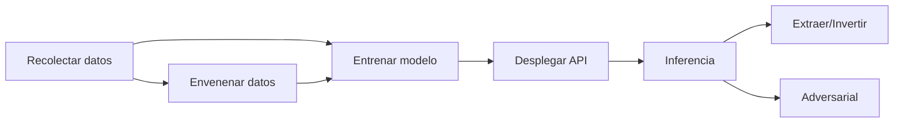

---
tags:
  - ml-security
  - adversarial-attacks
  - model-extraction
  - data-poisoning
  - incident-response
  - differential-privacy
  - model-monitoring
status: seedling
created: 2026-06-28
---

## 1. Escenario de aprendizaje

Tu modelo de clasificación bancaria está detrás de una API pública. Alguien descubre que puede extraer el modelo haciendo consultas sistemáticas (model extraction). Peor aún: un atacante logró envenenar tu dataset de entrenamiento inyectando 100 transacciones fraudulentas etiquetadas como legítimas. El modelo ahora aprueba fraudes. No lo detectaste hasta que el equipo de fraude te avisó.

## 2. Requisitos previos

- ML básico: clasificación, entrenamiento, inferencia
- Conceptos de seguridad: threat modeling, CIA triad
- Familiaridad con APIs REST
- Conocimiento de [[Privacy Regulations]] para entender impacto legal

## 3. Threat landscape

Los modelos de ML tienen vectores de ataque únicos que no existen en software tradicional.

### 3.1 Principales ataques

| Ataque | Objetivo | Superficie |
|--------|----------|------------|
| Data poisoning | Manipular entrenamiento | Datos de entrenamiento |
| Model extraction | Robar el modelo | API de inferencia |
| Adversarial examples | Engañar al modelo | Input a inferencia |
| Membership inference | Saber si un dato estuvo en entrenamiento | Output de inferencia |
| Model inversion | Reconstruir datos de entrenamiento | Output + API |

### 3.2 Ciclo de vida del ataque



## 4. Adversarial attacks

Un adversarial example modifica mínimamente una entrada para cambiar la predicción del modelo. El cambio es imperceptible para un humano.

### 4.1 Fast Gradient Sign Method (FGSM)

```python
import torch
import torch.nn.functional as F

def fgsm_attack(model, image: torch.Tensor, epsilon: float = 0.01) -> torch.Tensor:
    """
    Genera un adversarial example usando FGSM.
    Modifica la imagen en la dirección que maximiza la pérdida.
    """
    image.requires_grad = True
    output = model(image.unsqueeze(0))
    loss = F.cross_entropy(output, torch.tensor([0]))  # target = clase 0
    model.zero_grad()
    loss.backward()
    # Firmar el gradiente y escalar por epsilon
    perturbation = epsilon * image.grad.sign()
    adversarial = image + perturbation
    # Recortar para mantener valores válidos
    adversarial = torch.clamp(adversarial, 0, 1)
    return adversarial

# Ejemplo con imagen de un "8" que el modelo clasifica como "3"
original_pred = model(original_image.unsqueeze(0)).argmax().item()
adv_image = fgsm_attack(model, original_image, epsilon=0.05)
adv_pred = model(adv_image.unsqueeze(0)).argmax().item()
print(f"Original: {original_pred} → Adversarial: {adv_pred}")
```

**Salida esperada:**
```
Original: 8 → Adversarial: 3
```

## 5. Defensas

Las defensas operan en distintas capas: datos, modelo e infraestructura. [[Model Monitoring]] es crítico para detectar ataques en producción.

### 5.1 Adversarial training

```python
def adversarial_training(model, dataloader, epochs=10, epsilon=0.05):
    """
    Entrena el modelo con ejemplos adversariales para hacerlo robusto.
    """
    optimizer = torch.optim.Adam(model.parameters())
    for epoch in range(epochs):
        for images, labels in dataloader:
            # Generar adversarial examples on-the-fly
            adv_images = torch.stack([
                fgsm_attack(model, img, epsilon) for img in images
            ])
            # Entrenar con mezcla de originales y adversariales
            all_images = torch.cat([images, adv_images])
            all_labels = torch.cat([labels, labels])
            output = model(all_images)
            loss = F.cross_entropy(output, all_labels)
            optimizer.zero_grad()
            loss.backward()
            optimizer.step()
    return model
```

### 5.2 Input sanitization

```python
def sanitize_input(raw_input: dict, model_config: dict) -> dict:
    """
    Valida y sanitiza inputs antes de pasarlos al modelo.
    """
    sanitized = {}
    for field, config in model_config["features"].items():
        value = raw_input.get(field)

        if config["type"] == "numeric":
            # Recortar a rangos esperados
            min_v, max_v = config["range"]
            value = max(min_v, min(max_v, value))
            # Redondear para evitar ataques de precisión
            value = round(value, config.get("precision", 4))

        elif config["type"] == "categorical":
            # Solo permitir valores conocidos
            if value not in config["allowed_values"]:
                value = config.get("default", "unknown")

        sanitized[field] = value

    # Detectar outliers extremos con z-score
    return sanitized
```

### 5.3 Differential privacy

```python
def add_laplace_noise(gradient: torch.Tensor, epsilon: float, sensitivity: float) -> torch.Tensor:
    """
    Agrega ruido de Laplace para differential privacy en entrenamiento.
    epsilon controla el trade-off privacidad/utilidad.
    """
    scale = sensitivity / epsilon
    noise = torch.from_numpy(
        np.random.laplace(0, scale, size=gradient.shape)
    ).float()
    return gradient + noise
```

### 5.4 Rate limiting en API

```yaml
# API Gateway: rate limiting para prevenir model extraction
openapi: "3.0.0"
info:
  title: "ML Inference API"
  version: "1.0.0"
x-amazon-apigateway-request-validator: full
paths:
  /predict:
    post:
      x-amazon-apigateway-request-throttle:
        rate: 10        # 10 requests por segundo
        burst: 20       # máximo 20 en ráfaga
      x-amazon-apigateway-usage-plan:
        quota:
          limit: 1000   # 1000 requests por día por API key
          period: DAY
```

## 6. Model extraction

El atacante consulta la API repetidamente con inputs sintéticos y usa las predicciones para entrenar un modelo sustituto.

### 6.1 Protección con output perturbation

```python
from random import uniform

def perturb_output(prediction: dict, epsilon: float = 0.1) -> dict:
    perturbed = {}
    for class_name, prob in prediction["probabilities"].items():
        noise = uniform(-epsilon, epsilon)
        perturbed[class_name] = max(0.0, min(1.0, prob + noise))
    total = sum(perturbed.values())
    return {k: v / total for k, v in perturbed.items()} if total > 0 else perturbed
```

### 6.2 Monitoreo de queries anómalas

```python
from collections import defaultdict

class ExtractionDetector:
    def __init__(self, window_size: int = 100):
        self.window_size = window_size
        self.user_queries = defaultdict(list)

    def log_query(self, user_id: str, features: dict) -> bool:
        self.user_queries[user_id].append(features)
        window = self.user_queries[user_id][-self.window_size:]
        if len(window) < self.window_size:
            return False

        feature_values = sum(len(q) for q in window)  # approximate coverage
        coverage = feature_values / (self.window_size * len(window[0]))
        uniqueness = len(set(str(q) for q in window)) / len(window)

        if coverage > 0.8 or uniqueness > 0.95:
            return True
        return False
```

## 7. Incident response playbook

Comparte principios con [[Secure ML & Incident Response]] pero adaptado a ML: el "activo" es el modelo, no solo los datos.

### 7.1 Playbook en 5 fases

```bash
# Fase 1: Detect — alerta de anomalía
curl -X POST https://incident.empresa.cl/api/v1/alerts \
  -d '{"type": "model_extraction", "user": "anon_4523", "confidence": 0.92}'
```

**Salida esperada:**
```
{"incident_id": "ML-IR-2026-06-28-001", "status": "triaging", "assigned_to": "soc-team"}
```

```yaml
incident:
  id: "ML-IR-2026-06-28-001"
  detected: "2026-06-28T14:30:00Z"
  source: "extraction_detector"
  contain:
    - block_api_key: "anon_4523"  @ 14:31
    - ratelimit_drop: "203.0.113.0/24"  @ 14:32
  eradicate:
    - invalidate_cache: "model_v2.3.1"
    - retrain: "training_dataset_v2.1"
  recover:
    - deploy: "model_v2.3.2"  @ 15:00
  post_mortem:
    owner: "ml-security-team"
    due: "2026-07-05"
    actions:
      - "rate_limiting_por_api_key"
      - "output_perturbation_epsilon_0.1"
      - "dashboard_cobertura_queries"
```

## 8. Common Mistakes

1. **No monitorear queries anómalas**: El ataque de model extraction toma horas o días. Sin monitoreo de cobertura de features, no lo detectas hasta que el modelo sustituto compite con el tuyo.
2. **Confiar en datos no validados**: Si el pipeline de entrenamiento no valida las etiquetas (data poisoning), cualquier atacante puede inyectar datos maliciosos. Implementa [[Data Quality & Testing]] en los datos de entrenamiento.
3. **Sin plan de respuesta**: Cuando ocurre un incidente de ML, no hay playbook. El equipo no sabe quién bloquea la API, quién notifica a los usuarios, quién decide si retrain. Necesitas un incident response plan específico para ML.
4. **Output sin perturbar**: Devolver probabilidades exactas permite al atacante entrenar un modelo casi idéntico. Siempre perturba la salida o usa top-k en vez de distribución completa.
5. **Ignorar membership inference**: Incluso si el modelo es público, el atacante puede saber si una persona específica estuvo en los datos de entrenamiento. Esto viola [[Privacy Regulations]] si los datos son médicos o financieros.

## Resumen

Los modelos de ML tienen vectores de ataque únicos: data poisoning, model extraction, adversarial examples y membership inference. Defenderse requiere múltiples capas: adversarial training para robustez, input sanitization para prevenir adversarial examples, output perturbation contra extracción, rate limiting en API, differential privacy, y monitoreo continuo de patrones de consulta anómalos. Un incident response playbook específico para ML debe cubrir detect, contain, eradicate, recover, y post-mortem. La seguridad en ML no es opcional — es un requisito regulatorio y de negocio.

## Comprueba tu Conocimiento

1. ¿Qué diferencia hay entre model extraction y membership inference?
2. ¿Por qué FGSM se considera un ataque de "caja blanca"?
3. ¿Qué métrica usarías para detectar un ataque de model extraction?
4. ¿Cómo protege la output perturbation contra model extraction?
5. ¿Por qué el adversarial training mejora la robustez del modelo?

<!--
1. Model extraction: el atacante entrena un modelo sustituto que imita al original consultando la API. Membership inference: el atacante determina si un registro específico estuvo en el dataset de entrenamiento. El primero roba funcionalidad, el segundo roba privacidad.
2. Porque requiere acceso al gradiente del modelo, lo que implica conocer la arquitectura y los pesos. Los ataques de "caja negra" solo usan las predicciones.
3. Cobertura de features (qué proporción del espacio de entrada ha explorado) y repetitividad (si siempre pide combinaciones nuevas). Alta cobertura + baja repetitividad = extracción probable.
4. Agrega ruido a las probabilidades devueltas por la API. El atacante recibe una versión distorsionada, por lo que el modelo sustituto será menos preciso. El usuario legítimo sigue viendo la dirección correcta de la predicción.
5. Porque expone al modelo a ejemplos adversariales durante el entrenamiento, forzándolo a aprender fronteras de decisión más suaves y menos sensibles a pequeñas perturbaciones. Es análogo a la regularización.
-->

## ¿Dónde ir Siguente?

- [[Privacy & Security in ML]]
- [[Privacy Regulations]]
- [[ML Governance & Regulation]]
- [[Model Monitoring]]
- [[API Design for ML]]
- [[Observability]]
- [[Data Quality & Testing]]
